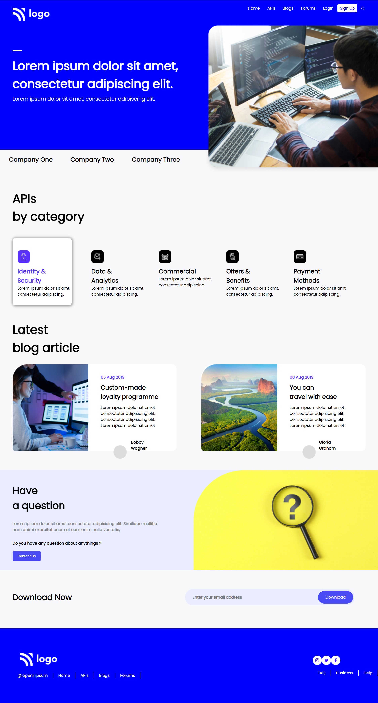

# Hey Welcome

Hi, My name is Uvesh Khatri and I have completed the 9th Project of the iNeuron Full Stack Course.

# Project 9

In this project i have created a Devloper Landing Page from Scratch. And i have learnt a lot of things like Position, flexbox.

It took me 1 day to complete this project

### Mobile Responsive ✅

## Tech Stack Used 
- HTML5

- CSS

## My Project is looking like :
[Live Link](https://uveshkhatri-devloper-landingpage.netlify.app/)

[Live Link](https://uveshkhatri-devloper-landingpage.netlify.app/)